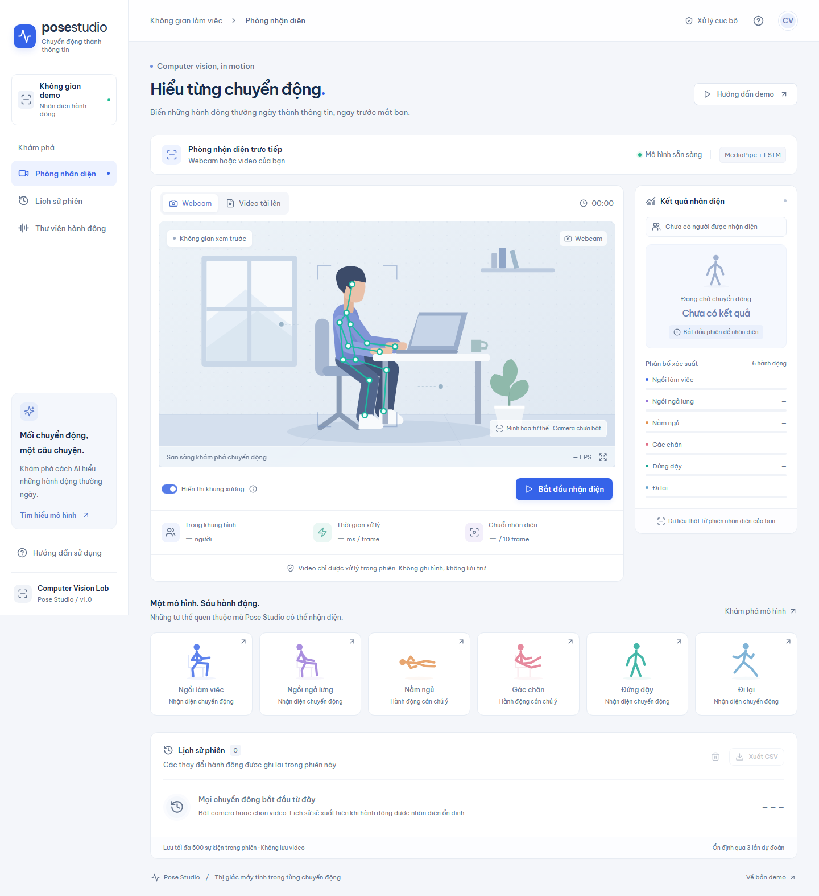

# Pose Studio

Demo nhận diện sáu hành động nơi làm việc với **React/TypeScript (FE)** và **FastAPI + MediaPipe + LSTM (BE)**. Dùng model có sẵn, không huấn luyện lại.



## Bắt đầu nhanh

Tất cả lệnh chạy trong PowerShell, tại thư mục gốc dự án.

```powershell
# 1. Cài đặt (một lần)
py -3.11 -m venv venv
.\venv\Scripts\python.exe -m pip install -r be/requirements-dev.txt
cd fe; npm.cmd ci; cd ..

# 2. Kiểm thử toàn bộ
.\scripts\test.ps1 -E2E

# 3. Chạy demo: mỗi lệnh một terminal, rồi mở http://127.0.0.1:5173
.\scripts\start-be.ps1
.\scripts\start-fe.ps1
```

Nếu PowerShell báo không cho chạy script, chạy trước trong terminal đó:

```powershell
Set-ExecutionPolicy -Scope Process Bypass
```

## Cấu trúc thư mục

```text
be/       Backend FastAPI: nạp model, tracking, WebSocket, tests
fe/       Frontend React + TypeScript + Vite, unit test và Playwright E2E
ml/       Pipeline gốc: thu thập dữ liệu, huấn luyện, nhận diện OpenCV
models/   best_lstm_model.keras (LSTM) và pose_landmarker_heavy.task (MediaPipe)
data/     Dữ liệu CSV sáu hành động (33 landmark × x, y, z, visibility)
scripts/  start-be.ps1, start-fe.ps1 (chạy demo) và test.ps1 (kiểm thử)
docs/     Ảnh giao diện và báo cáo kiểm chứng
```

## Cài đặt lần đầu

Cần **Python 3.11** và **Node.js 22.12+ hoặc 24 LTS**. Model lưu bằng Keras 2.15 nên không dùng Python 3.12 cho bộ dependencies này.

```powershell
git clone https://github.com/phamhai24/Human-Pose_recognition.git
cd Human-Pose_recognition
py -3.11 -m venv venv
.\venv\Scripts\python.exe -m pip install -r be/requirements-dev.txt
cd fe
npm.cmd ci
cd ..
```

- Nếu `py` không tìm thấy Python 3.11, dùng đường dẫn đầy đủ tới `python.exe` của Python 3.11 để tạo venv.
- Các script tìm môi trường ảo ở `venv/` hoặc `.venv/`.
- Hai asset bắt buộc đã có trong repo: `models/best_lstm_model.keras` và `models/pose_landmarker_heavy.task`. Asset MediaPipe cũng có thể tải lại từ [kho model chính thức](https://storage.googleapis.com/mediapipe-models/pose_landmarker/pose_landmarker_heavy/float16/1/pose_landmarker_heavy.task).

## Chạy demo

Mở hai terminal tại thư mục gốc dự án:

```powershell
# Terminal 1: backend, http://127.0.0.1:8000
.\scripts\start-be.ps1

# Terminal 2: frontend, http://127.0.0.1:5173
.\scripts\start-fe.ps1
```

1. Mở **http://127.0.0.1:5173** và đợi thanh trạng thái hiện **Mô hình sẵn sàng**.
2. Chọn **Webcam** hoặc **Video tải lên**, bấm **Bắt đầu nhận diện**.
3. Để camera thấy toàn thân; sau khoảng 10 frame bảng bên phải hiện xác suất sáu hành động.
4. Bấm dừng để giải phóng camera; `Ctrl+C` ở cả hai terminal để tắt server.

Kiểm tra nhanh backend: http://127.0.0.1:8000/api/health trả `"status": "ready"`. Tài liệu API: http://127.0.0.1:8000/docs.

Chạy không qua script:

```powershell
# Terminal 1, tại repo root
.\venv\Scripts\python.exe -m uvicorn be.app.main:app --host 127.0.0.1 --port 8000 --ws-max-size 2097152 --ws-max-queue 1

# Terminal 2
cd fe
npm.cmd run dev
```

## Kiểm thử

Một lệnh chạy tất cả, tại repo root:

```powershell
.\scripts\test.ps1                                     # pytest BE, smoke model thật, Vitest FE, build (~45 giây)
.\scripts\test.ps1 -E2E                                # thêm Playwright E2E (~2 phút)
.\scripts\test.ps1 -E2E -Video C:\path\to\clip.mp4     # test nhận diện bằng video của bạn
```

- Với `-E2E`, script tự bật BE/FE nếu chưa chạy, đợi model sẵn sàng, cài Chromium cho Playwright khi cần, chạy test rồi tắt các server nó đã bật.
- Test "uploaded video" cần một video MP4/WebM có người trong khung hình. Không truyền `-Video` và không có video mẫu cục bộ thì test này bị skip (5 passed, 1 skipped).
- Cuối cùng script in bảng PASS/FAIL từng bước và trả exit code khác 0 nếu có bước lỗi. Log server và ảnh chụp test nằm ở `fe/test-results/` (không commit).

Chạy từng bước thủ công:

```powershell
.\venv\Scripts\python.exe -m pytest be/tests -q
.\venv\Scripts\python.exe -m be.scripts.smoke_model
cd fe; npm.cmd test; npm.cmd run build
npx.cmd playwright test   # cần BE + FE đang chạy; đặt $env:POSE_TEST_VIDEO để test video
```

Kết quả kiểm chứng gần nhất: [docs/verification.md](docs/verification.md). Xem production build bằng `npm.cmd run preview` trong `fe/`, mở `http://127.0.0.1:4173`.

## Tính năng

- Webcam hoặc video MP4/WebM cục bộ; vẽ khung xương, chọn người xem kết quả.
- Sáu hành động: ngồi làm việc, ngồi ngả lưng, nằm ngủ, gác chân, đứng dậy, đi lại.
- Xác suất từng nhãn, FPS thực tế, thời gian xử lý, tiến độ 10 frame.
- Lịch sử sau ba dự đoán cùng nhãn; lưu 500 sự kiện, hiển thị 100 gần nhất, xuất CSV toàn bộ lịch sử còn trong phiên.
- Nằm ngủ và gác chân được đánh dấu “Cần chú ý”; không đánh giá năng suất.
- Giao diện tiếng Việt responsive, font cục bộ, hướng dẫn và thư viện tư thế.

Ảnh trước khi chạy là **minh họa**, không phải kết quả model. Không tự bật camera, không ghi hình hoặc lưu video. Video được đọc trong browser, từng frame JPEG gửi tới backend local. Dừng phiên giữ lịch sử trong bộ nhớ tab; tải lại trang sẽ mất lịch sử.

## Kiến trúc và API

```text
fe/ React + TypeScript + Vite
  Camera/video → JPEG → WebSocket → kết quả + overlay + lịch sử
be/ FastAPI
  JPEG → MediaPipe (33 landmark) → tracker riêng từng người
       → 10 × 132 đặc trưng → Bidirectional LSTM → 6 xác suất
```

- `GET /api/health`: trạng thái model; `WS /api/recognize`: binary JPEG → JSON `result`/`error`.
- Tối đa hai người mỗi frame, bốn phiên; tracker và buffer riêng từng phiên.
- Client tối đa 10 frame/giây, chỉ một frame đang chờ; cạnh dài resize xuống 960 px.
- JPEG tối đa 2 MiB, ảnh tối đa 2.073.600 pixel; khóa model và giới hạn concurrency.
- Mất người, ghép không chắc chắn hoặc gián đoạn quá hai giây sẽ reset chuỗi.

Vite dev/preview proxy `/api` tới `127.0.0.1:8000`. Tùy chọn `VITE_API_URL` trong `fe/.env` đổi backend URL (xem `fe/.env.example`). BE hỗ trợ biến môi trường `POSE_MODEL_PATH`, `POSE_LANDMARKER_PATH`, `POSE_ALLOWED_ORIGINS` (origin ngăn cách dấu phẩy; mặc định localhost/127.0.0.1 cổng 5173/4173). Bản demo chạy local, chưa có xác thực cho public deployment.

## Giới hạn

- Độ tin cậy là xác suất model, không phải độ chính xác kiểm định.
- Smoke test chạy được sáu CSV; chuỗi đầu `di_lai.csv` được model gốc dự đoán là đứng dậy. Ứng dụng giữ kết quả thật.
- Tracking dựa trên vị trí, không nhận dạng danh tính; che khuất/giao nhau có thể reset hoặc đổi ID.
- Kết quả phụ thuộc ánh sáng, góc camera, toàn thân trong khung hình và nhịp frame.
- Video phân tích khi phát, không phải offline toàn bộ frame; xử lý chậm sẽ bỏ qua frame ở giữa.
- TensorFlow/MediaPipe cũ có thể in cảnh báo deprecation; kiểm tra health/log để phân biệt lỗi.

## Pipeline gốc (`ml/`)

Các script chạy từ repo root, dùng môi trường riêng cài `ml/requirements.txt` (cần pandas/scikit-learn, khác bộ dependencies của `be/`).

```powershell
python ml/collect_data.py      # Webcam: phím 1–6 ghi hành động, SPACE dừng, Q thoát; append vào data/*.csv
python ml/train_model.py       # Huấn luyện Bidirectional LSTM, lưu vào ml/output/
python ml/recognize_webcam.py  # Nhận diện realtime bằng cửa sổ OpenCV, Q để thoát
```

`collect_data.py` được chuyển từ notebook `create_dataset/create_data.ipynb` cũ. Model huấn luyện mới lưu ở `ml/output/` (không commit) để không ghi đè `models/best_lstm_model.keras` đang dùng; muốn dùng thì chép đè thủ công.

Tham khảo: [TensorFlow](https://www.tensorflow.org/install/source), [Vite](https://vite.dev/guide/), [MediaPipe Pose Landmarker](https://ai.google.dev/edge/mediapipe/solutions/vision/pose_landmarker).
